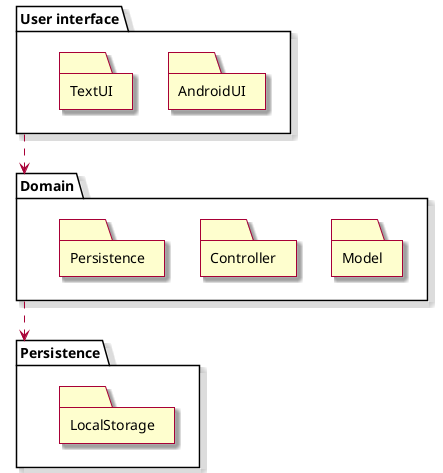
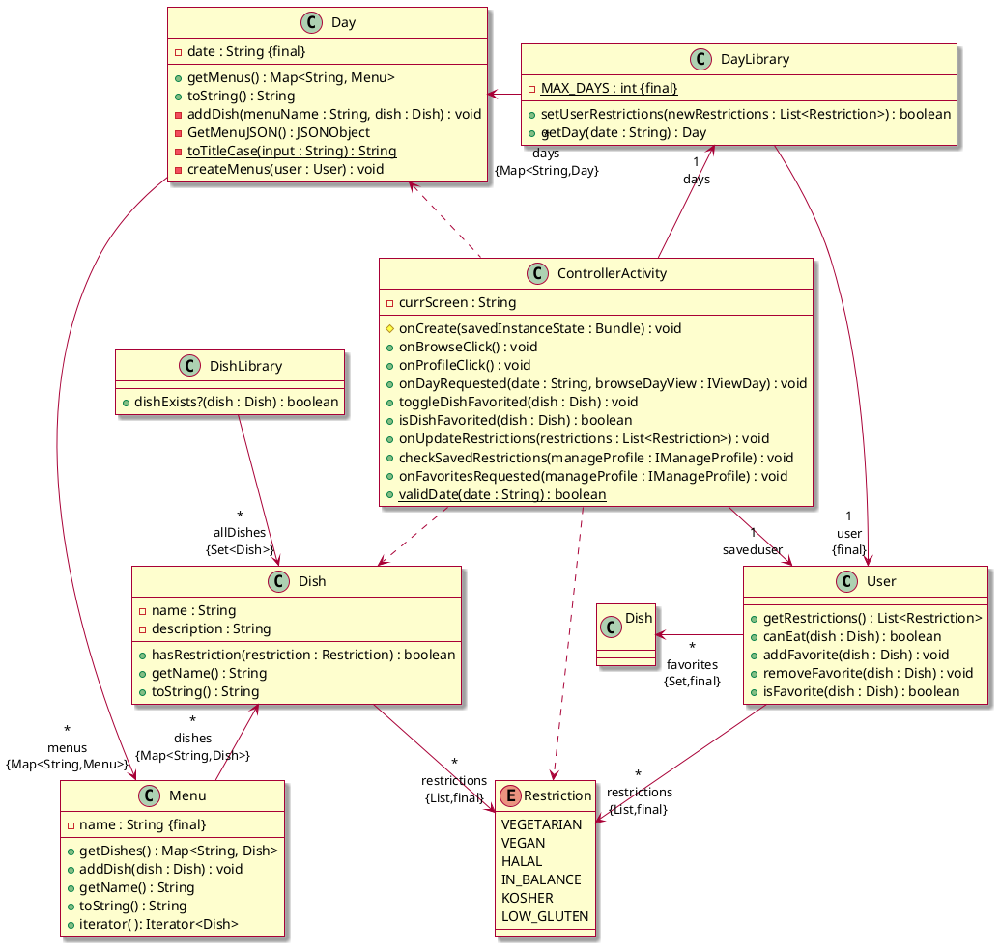
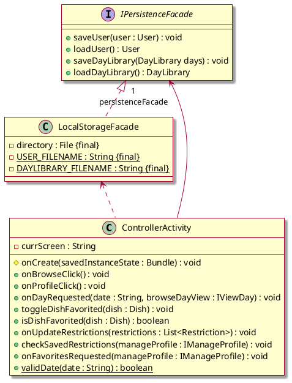
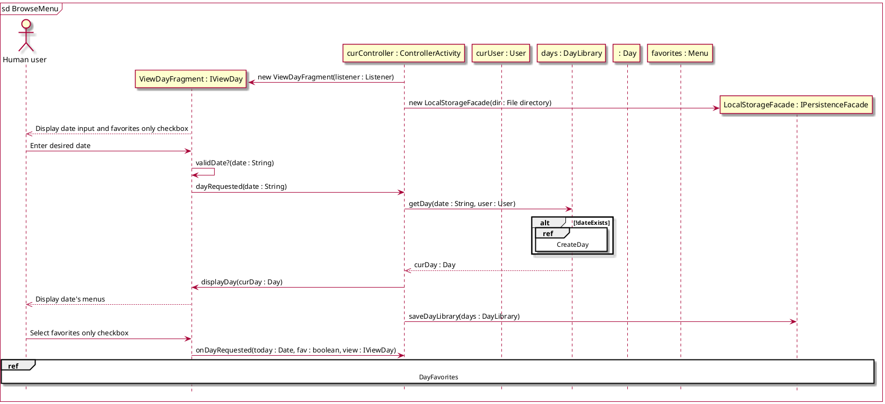
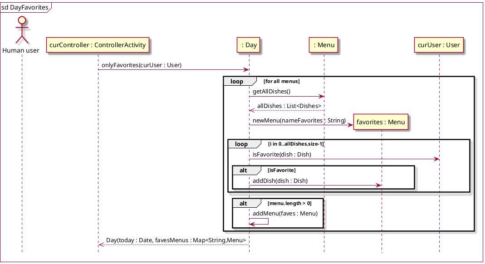
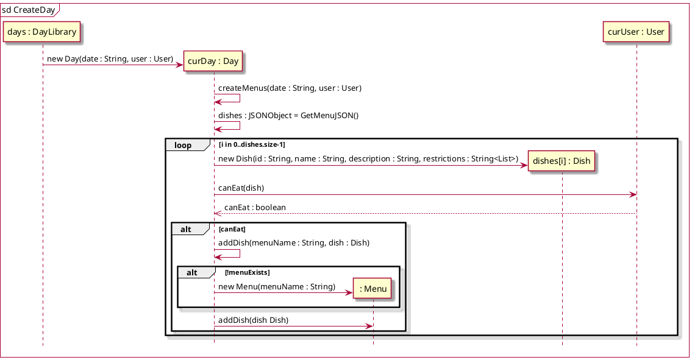
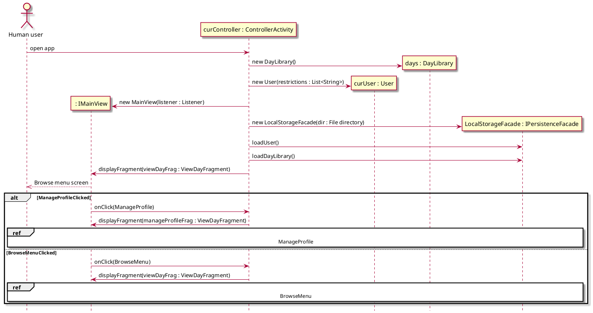
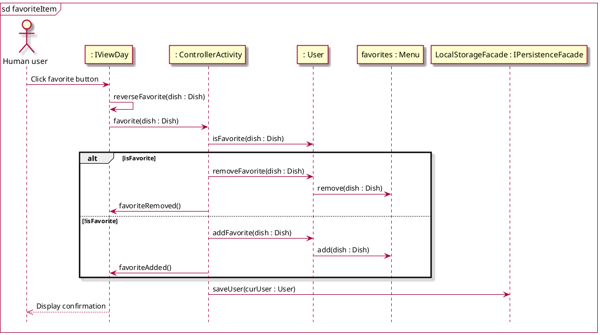
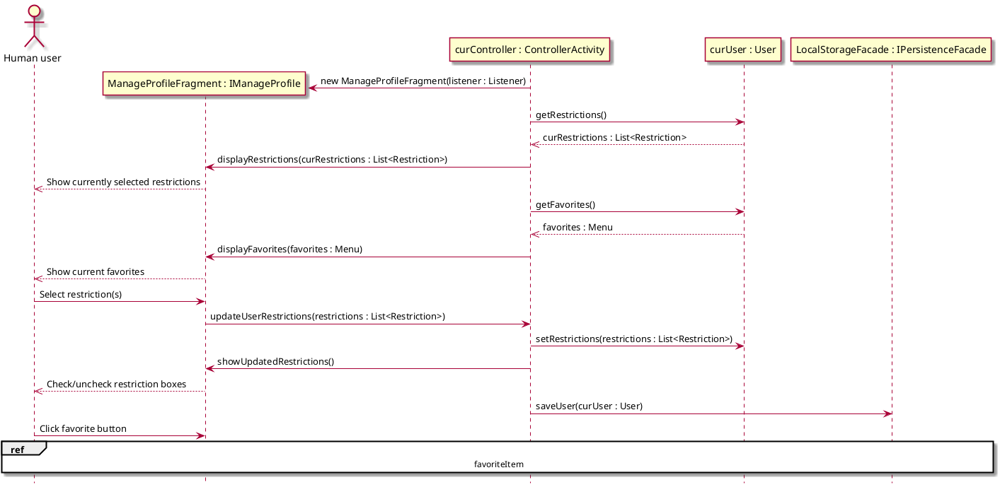

# Design Class Diagram

Classes with attributes
* User: Favorites (list of Dishes), Reviews (list of Reviews), Dietary restrictions (list of Strings)
* Review: rating (integer 0<=x<=5), Dish
* Dish: name (String), Dietary restrictions (list of Strings), Average rating (int), Reviews (list of Reviews)
* Day: date, list of Menus
* Menu: station name (String), list of Dishes


## Package diagram


## AndroidUI class diagram
```plantuml
skin rose
'classes
interface IMainView{
    --
    + getRootView() : View
    + displayFragment(fragment : Fragment, addToStack : boolean, name : String) : void
}
interface IMainView.Listener{
    --
    ~ onBrowseClick() : void
    ~ onProfileClick() : void
}
interface IViewDay{
    --
    ~ updateDayDisplay(day : Day, listener : DishViewHolder.Listener) : void
    ~ onInvalidDate(rootView : View) : void
}
interface IViewDay.Listener{
    --
    ~ onDayRequested(date : String, favoritesOnly : boolean, browseDayView : IViewDay) : void
}
interface IManageProfile{
    --
    ~ updateFavoritesDisplay( ): void
    ~ setUserRestrictions(List<Restriction> restrictions) : void
}
interface IManageProfile.Listener{
    --
    ~ onUpdateRestrictions(restrictions : List<Restriction>) : void
    ~ toggleDishFavorited(dish : Dish) : void
    ~ isDishFavorited(dish : Dish) : boolean
    ~ onFavoritesRequested(manageProfile : IManageProfile) : void
    ~ checkSavedrestrictions(manageProfile : IManageProfile) : void
}
class MainView{
    - fmanager : FragmentManager {final}
    - binding : ActivityMainBinding {final}
    - listener : Listener {final}
    --
    + getRootView() : View
    + displayFragment(fragment : Fragment, addToStack : boolean, name : String) : void
}
class ViewDayFragment{
    - binding : FragmentViewDayBinding
    - listener : Listener {final}
    --
    + onCreateView(inflater : LayoutInflater, container : ViewGroup, savedInstanceState : Bundle) : View
    + onViewCreated(view : View, savedInstanceState : Bundle) : void
    + updateDateDisplay(day : Day, listener : DishViewHolder.Listener) : void
    + onInvalidDate(rootView : View) : void
}
class ManageProfileFragment{
    - binding : FragmentManageProfileBinding
    - listener : IManageProfile.Listener {final}
    --
    + onCreateView(inflater : LayoutInflater, container : ViewGroup, savedInstanceState : Bundle) : View
    + onViewCreated(view : View, savedInstanceState : Bundle) : void
    + updateFavoritesDisplay() : void
    + setUserRestrictions(restrictions : List<Restriction>) : void
    + getCheckedRestrictions() : List<Restriction>
}
class ControllerActivity{
    - currScreen : String
    --
    # onCreate(savedInstanceState : Bundle) : void
    + onBrowseClick() : void
    + onProfileClick() : void
    + onDayRequested(date : String, browseDayView : IViewDay) : void
    + toggleDishFavorited(dish : Dish) : void
    + isDishFavorited(dish : Dish) : boolean
    + onUpdateRestrictions(restrictions : List<Restriction>) : void
    + checkSavedRestrictions(manageProfile : IManageProfile) : void
    + onFavoritesRequested(manageProfile : IManageProfile) : void
    + {static} validDate(date : String) : boolean
}
class Menu{
    - name : String {final}
    --
    + getDishes() : Map<String, Dish>
    + addDish(dish : Dish) : void
    + getName() : String
    + toString() : String
    + iterator( ): Iterator<Dish>
}

'associations
ControllerActivity -up-> MainView
ControllerActivity .down.> ViewDayFragment
ControllerActivity .right.> ManageProfileFragment

MainView -> IMainView.Listener
ViewDayFragment -> IViewDay.Listener
ManageProfileFragment -> IManageProfile.Listener
ManageProfileFragment -> "1\nfavoritesAsMenu\n{final}" Menu

IMainView <|.. MainView
IViewDay <|.. ViewDayFragment
IManageProfile <|.. ManageProfileFragment
IMainView.Listener <|.. ControllerActivity
IViewDay.Listener <|.. ControllerActivity
IManageProfile.Listener <|.. ControllerActivity

```

## Model class diagram


### Persistence class diagram


## Sequence diagrams
### Browse menu


### Get favorites for a day


### Scrape website menu


### Navigate app


### Favorite item


### Manage profile

