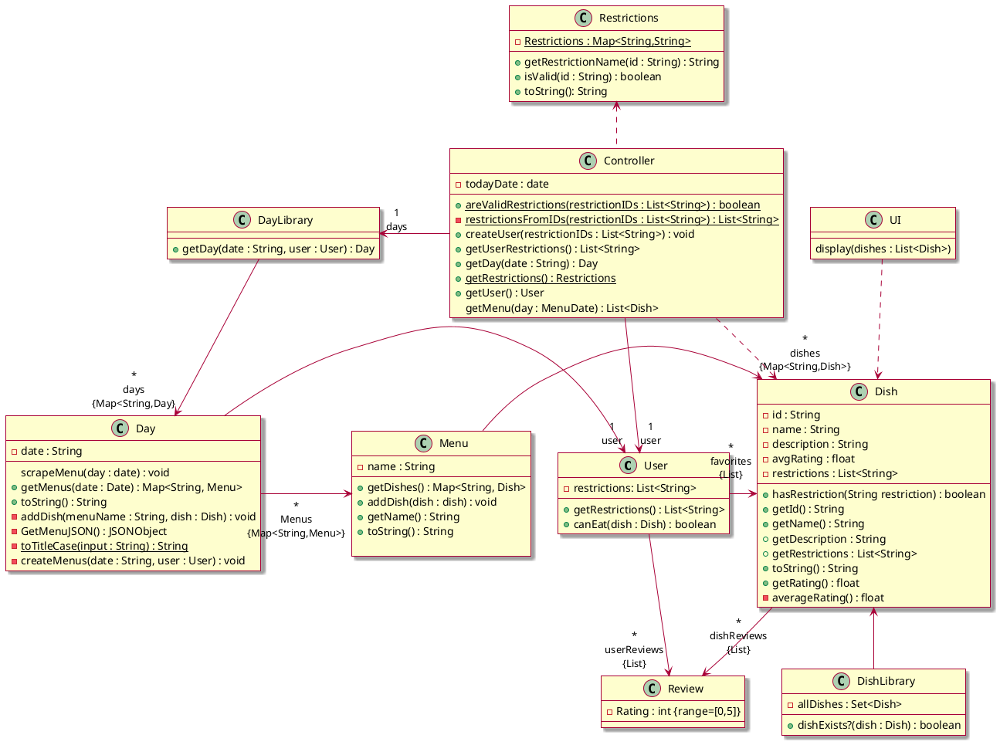

# Design Class Diagram

Classes with attributes
* User: Favorites (list of Dishes), Reviews (list of Reviews), Dietary restrictions (list of Strings)
* Review: rating (integer 0<=x<=5), Dish
* Dish: name (String), Dietary restrictions (list of Strings), Average rating (int), Reviews (list of Reviews)
* Day: date, list of Menus
* Menu: station name (String), list of Dishes

## Class diagram


## Sequence diagrams
### Browse menu
```plantuml
skin rose

hide footbox
actor "Human user" as human
participant " : UI" as ui
participant " : Controller" as controller
participant " : MenuLibrary" as menulib
participant "menus[i] : Menu" as menu
participant " : User" as user

human -> ui : Enter date of desired menu
ui -> controller : getMenu(date)
controller -> menulib: getMenus()
menulib -->> controller : menus : Set<Menu>
controller -> user : getRestrictions()
user -->> controller : restrictions : List<String>
loop i in 0..menus.size-1
    controller -> menu : getDishes(restrictions : List<String>)
    menu -->> controller : dishes : List<Dish>
end
controller -> ui : display(dishes)
ui -->> human : Display date's menus
```

### Scrape website menu
```plantuml
skin rose
hide footbox
participant " : Controller" as controller
participant " : MenuLibrary" as menulib
participant " : Menu" as menu
participant " : Dish" as dish
participant " : Website" as web

controller -> menulib : scrapeMenu(day : Date)
menulib -> web : http request
web --> menulib : html : String
loop String != ""
menulib -> dish **: new Dish( = create(name, description, avgRating, restrictions)
end
menulib -> menu **: menu = new Menu()
```

### Favorite item (not implementing now, only doing browse menu)
```plantuml
skin rose

hide footbox
actor "Human user" as human
participant " : UI" as ui
participant " : Controller" as controller
participant " : User" as user
human -> ui : Select item
ui -> controller : info(dish)
controller -> dish : details()
dish -->> controller : Name, Average Rating, Dietary restrictions, Description
controller -> ui : displaySingle(dish)
human -> ui : Favorite item
ui -> controller : favorite(dish : Dish)
controller -> user : addFavorite(dish : Dish)
user -->> controller : success : bool
alt success
    controller -> ui : favoriteAdded()
    ui -->> human : Display confirmation
else !success
    controller -> ui : favoriteFailure()
    ui -->> human : Display error
end
```