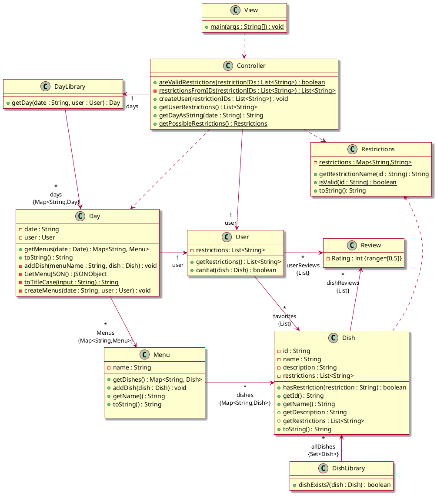
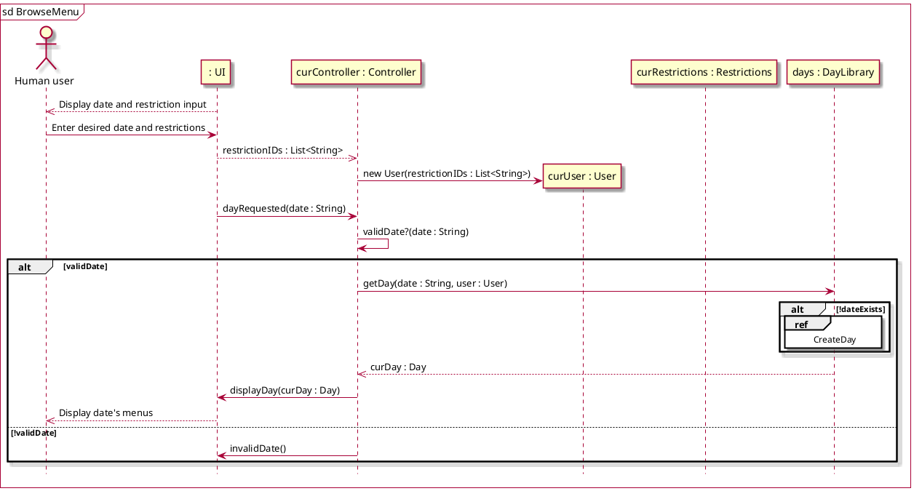
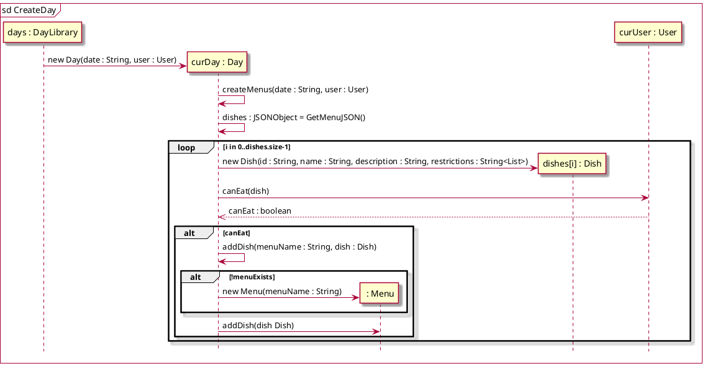
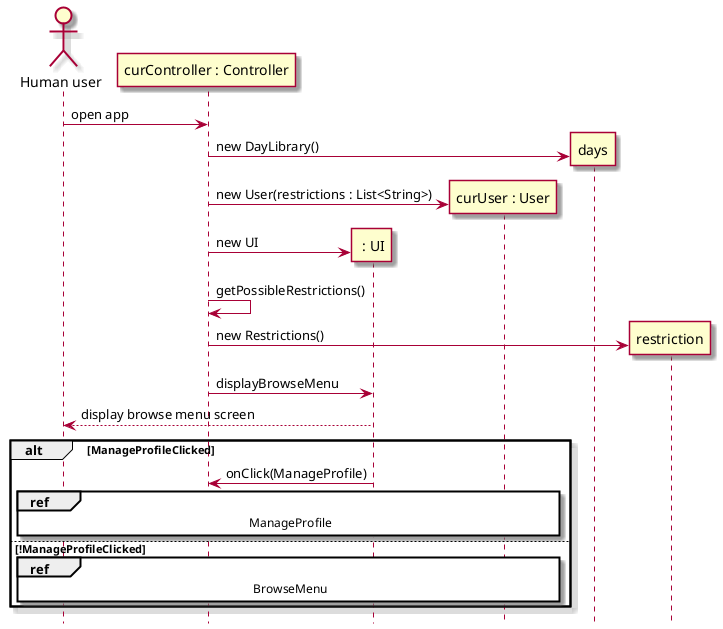

# Design Class Diagram

Classes with attributes
* User: Favorites (list of Dishes), Reviews (list of Reviews), Dietary restrictions (list of Strings)
* Review: rating (integer 0<=x<=5), Dish
* Dish: name (String), Dietary restrictions (list of Strings), Average rating (int), Reviews (list of Reviews)
* Day: date, list of Menus
* Menu: station name (String), list of Dishes

## Class diagram
Note that the DishLibrary class is not currently implemented, but we want to include it in the 
structure of our classes because we know we want to implement it in the next iteration. Reviews 
have also not been implemented but are included in the diagram for future iterations.

## Sequence diagrams
### Browse menu

### Scrape website menu

### Navigate app
