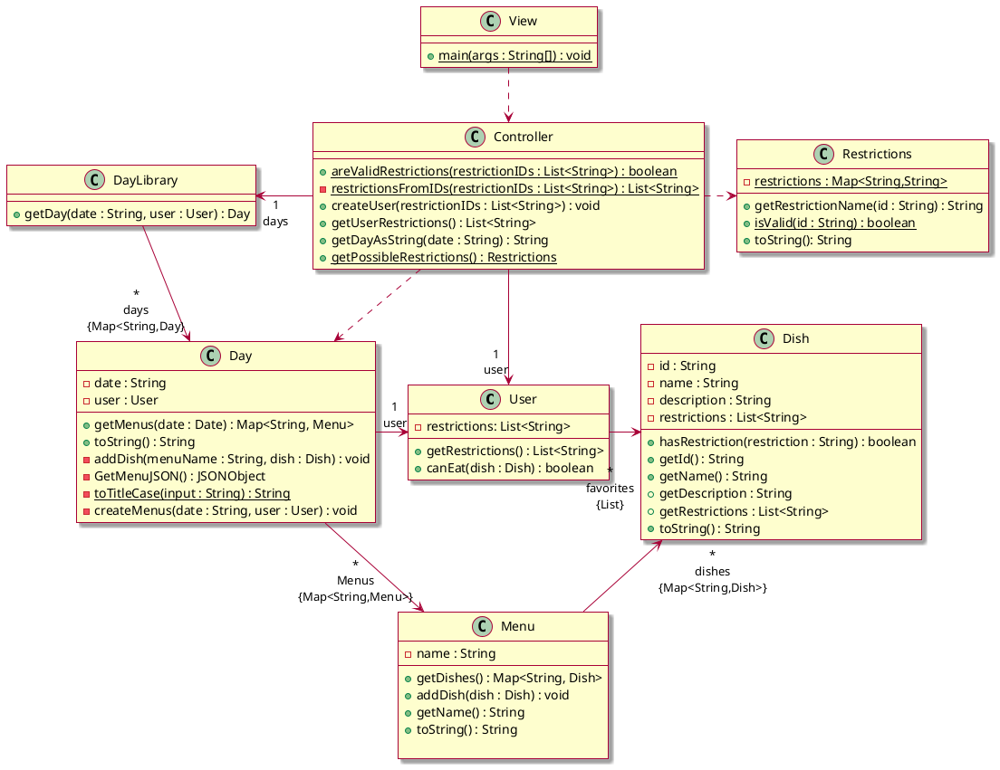
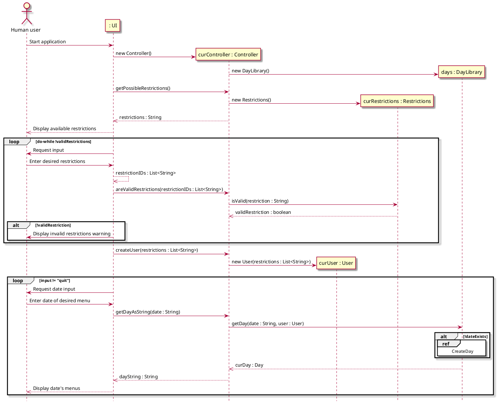
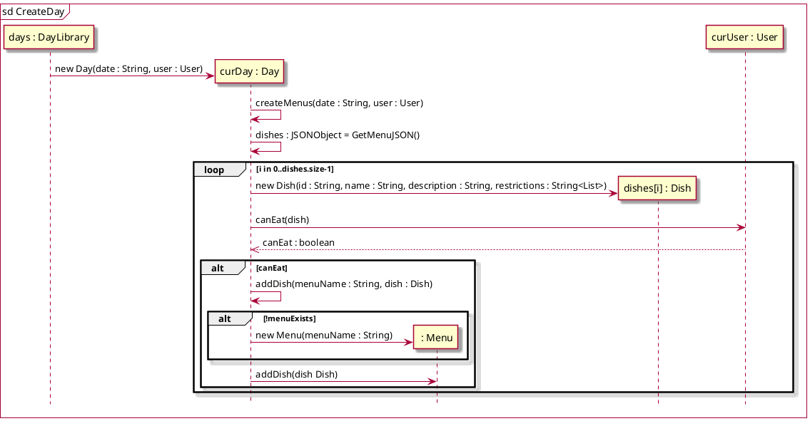

# Design Class Diagram

Classes with attributes
* User: Favorites (list of Dishes), Reviews (list of Reviews), Dietary restrictions (list of Strings)
* Review: rating (integer 0<=x<=5), Dish
* Dish: name (String), Dietary restrictions (list of Strings), Average rating (int), Reviews (list of Reviews)
* Day: date, list of Menus
* Menu: station name (String), list of Dishes

## Class diagram

## Sequence diagrams
### Browse menu

### Scrape website menu
