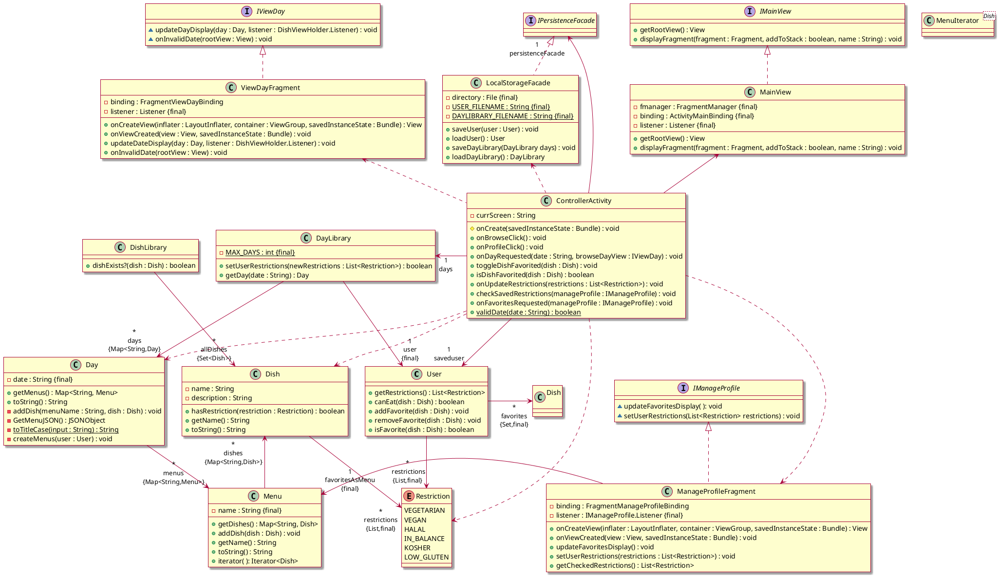
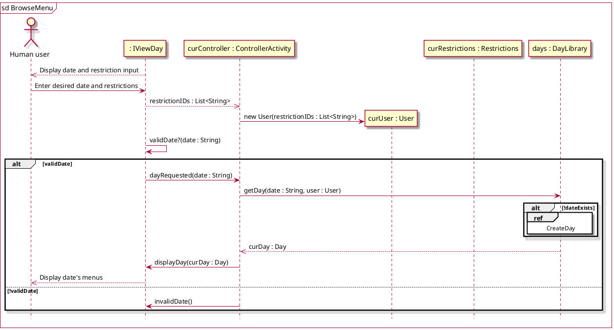
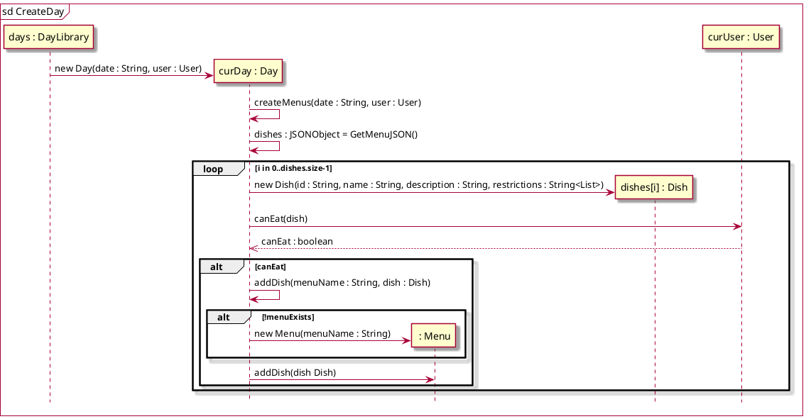
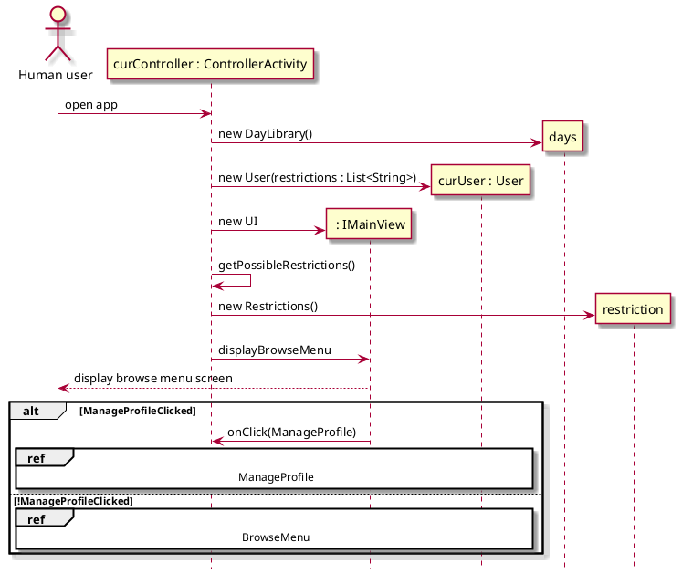

# Design Class Diagram

Classes with attributes
* User: Favorites (list of Dishes), Reviews (list of Reviews), Dietary restrictions (list of Strings)
* Review: rating (integer 0<=x<=5), Dish
* Dish: name (String), Dietary restrictions (list of Strings), Average rating (int), Reviews (list of Reviews)
* Day: date, list of Menus
* Menu: station name (String), list of Dishes

## Class diagram
DishLibrary class has not been implemented, it is planned to be implemented in the next
iteration when favorites are implemented. Reviews likely will not be implemented in the 
future but are included in the diagram for reference.

## Sequence diagrams
### Browse menu

### Scrape website menu

### Navigate app
