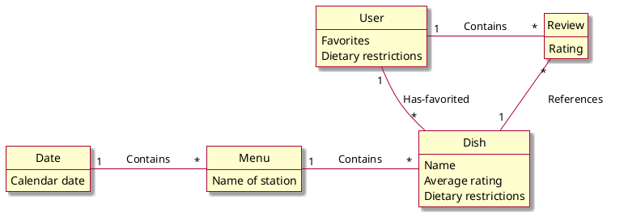

# Design Class Diagram

Classes
* User: Favorites (list of Dishes), Reviews (list of Reviews), Dietary restrictions (list of Strings)
* Review: rating (integer 0<=x<=5), Dish
* Dish: name (String), Dietary restrictions (list of Strings), Average rating (int), Reviews (list of Reviews)
* Day: date, list of Menus
* Menu: station name (String), list of Dishes

## Domain model


## Sequence diagram
```plantuml
skin rose

hide footbox
actor "Human user" as human
participant " : UI" as ui
participant " : Controller" as controller
participant "curDate : Date" as date
participant "menus[i] : Menu" as menu
participant " : User" as user

human -> ui : Enter date of desired menu
ui -> controller : getMenu(date)
controller -> date: getMenus()
date -->> controller : menus : List<Menu>
controller -> user : getRestrictions()
user -->> controller : restrictions : List<String>
loop i in 0..menus.size-1
    controller -> menu : getDishes(restrictions : List<String>)
    menu -->> controller : dishes : List<Dish>
end
controller -->> ui : Filtered menu
ui -->> human : Display date's menus

```