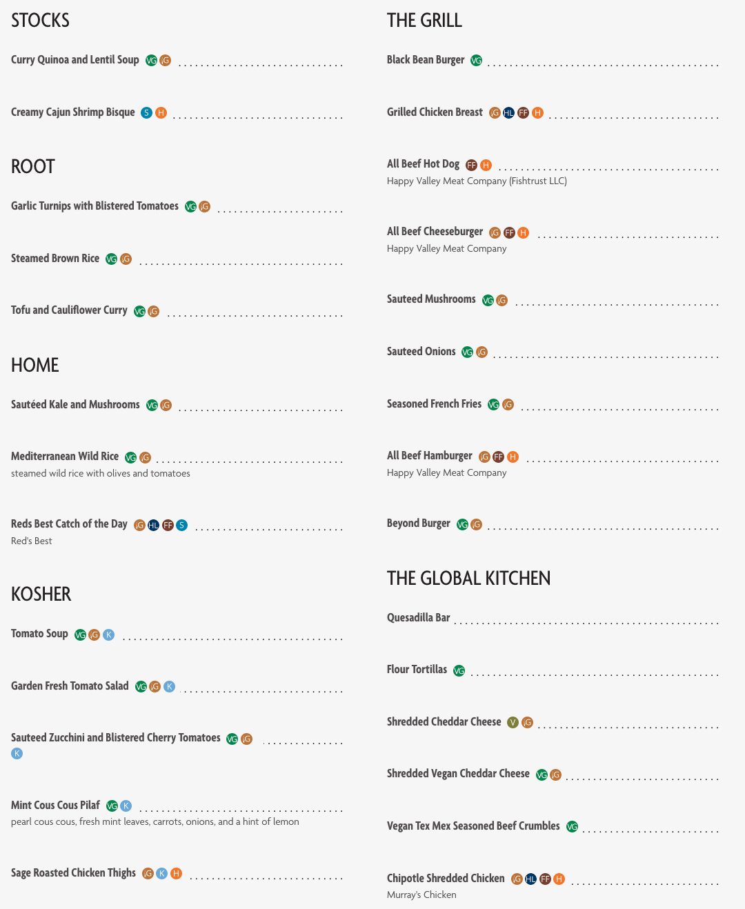

# Test Report

The main functionality of this prototype is to take a user's restrictions and
get menu items for a particular date that fit those restrictions. Therefore, our
tests should check that the program is returning menu items for the correct date,
which we can check against the Cafe Bon Appetit Website, and that it is returning
all items that fit the given restrictions without returning any items that do not
fit the restrictions. Additionally, we must test the basic functionality of the
prototype, making sure that it can take in input, validate that the input is 
correct, and print output in a readable manner. User input is indicated with 
"INPUT ->" at the beginning of the line, followed by the actual input. Some images
from the Cafe Bon Appetit website are provided, but the entire menu is not present
because of space constraints. All full menus can be found at 
https://vassar.cafebonappetit.com/cafe/gordon/[YYYY-MM-DD]/.

## Test 1
The first test is testing that the menu being printed to the terminal is that of
the appropriate date. Thus, there are no restrictions given. A random date was
chosen to ensure that the date being printed is not just today. Then another 
random date was chosen to ensure that multiple dates can be accessed. The first
date was chosen to be in the future while the second was chosen to be in the past,
to ensure that both future and past dates are accessible. Finally, today was 
tested to ensure that it remains accurate. All of the outputs were compared to the
actual Cafe Bon Appetit website and found to be correct for their dates. Some of the 
output has been cut for length, indicated by [...].

```console
Welcome to the CBA Menu App!
These are the allowed restrictions:
11: Kosher
1: Vegetarian
3: Seafood Watch
4: Vegan
6: Farm to Fork
7: In Balance
18: Humane
8: Organic
9: Made without Gluten-Containing Ingredients
10: Halal

Enter your restrictions separated by commas (e.g. "1, 9") or press enter to skip:
INPUT ->
restrictions: []
Enter a date in the format YYYY-MM-DD or type "quit" to exit:
INPUT -> 2021-11-18
Fetching meals for 2021-11-18...
Menu: @The Farmer's Table
	[...]
	
Menu: @Late Night
	Cheese Quesadillas
		-Restrictions: [Vegetarian]
	
Menu: @Pressed
	Vegan Italian Pressed Sandwich On Ciabatta
		-Description: thinly sliced roasted eggplant, roasted red peppers, olive and artichoke tapenade, spinach leaves on a ciabatta roll
		-Restrictions: [Vegan]
	Make Your Own Belgium Waffles
		-Restrictions: [Vegetarian]
	
Menu: @Smoothie
	Mango And Strawberry Smoothie
		-Description: frozen mango and strawberry<br />orange juice<br />ice
		-Restrictions: [Vegan, Made without Gluten-Containing Ingredients]
	
Menu: @The Deli
	[...]
	
Menu: @Root
	Pineapple Chia Breakfast Quinoa
		-Restrictions: [Vegan, Made without Gluten-Containing Ingredients]
	Make Your Own Vegan Waffles
		-Restrictions: [Vegan, Made without Gluten-Containing Ingredients]
	Oatmeal With Dried Fruit
		-Restrictions: [Vegan]
	Super Food Lunch
		-Description: spicy roasted sweet potatoes<br />white quinoa<br />sauteed kale
		-Restrictions: [Vegan, Made without Gluten-Containing Ingredients]
	Sweet Corn And Peas
		-Restrictions: [Vegan, Made without Gluten-Containing Ingredients]
	Sweet Yam Bake
		-Restrictions: [Vegan, Made without Gluten-Containing Ingredients]
	Savory Roasted Tofu With Carrots, Onions, And Celery
		-Restrictions: [Vegan, Made without Gluten-Containing Ingredients]
	
Menu: @Coffee & Sweets
	Pumpkin Cheesecake
		-Restrictions: [Vegetarian]
	Nilda's Vegan Short Bread
		-Description: Nilda's Desserts
		-Restrictions: [Vegan, Farm to Fork]
	Mini Assorted Muffins
		-Restrictions: [Vegetarian]
	Chocolate  Coffee Cake
		-Restrictions: [Vegetarian]
	Croissants
		-Restrictions: [Vegetarian]
	House Baked Assorted Cookies
		-Restrictions: [Vegetarian]
	Apple Pie
		-Restrictions: [Vegetarian]
	
Menu: @The Global Kitchen
	Southwestern Style Seasoned Shredded Chicken
		-Restrictions: [Made without Gluten-Containing Ingredients, Halal]
	Vegan Cheese Sauce With Coconut Milk
		-Restrictions: [Vegan]
	Cilantro Lime Rice
		-Restrictions: [Vegan, Made without Gluten-Containing Ingredients]
	Sour Cream
		-Restrictions: [Vegetarian]
	Tortilla Chips
		-Restrictions: [Vegan]
	[...]
	
Menu: @Beverages
	[...]
	
Menu: @The Grill
	[...]
	
Menu: @Oasis
	Herb Roasted Beef
		-Description: roasted vegetable gravy
		-Restrictions: [Made without Gluten-Containing Ingredients, Halal]
	Blistered Cherry Tomatoes
		-Description: olive oil, salt, and pepper
		-Restrictions: [Vegan, Made without Gluten-Containing Ingredients]
	Jasmine Rice
		-Restrictions: [Vegan, Made without Gluten-Containing Ingredients]
	Carrot And Celery Sticks
		-Restrictions: [Vegan, Made without Gluten-Containing Ingredients]
	Buffalo Chicken
		-Restrictions: [Made without Gluten-Containing Ingredients]
	Herbed Polenta
		-Restrictions: [Vegan, Made without Gluten-Containing Ingredients]
	Buffalo Chickpeas
		-Restrictions: [Vegan, Made without Gluten-Containing Ingredients]
	
Menu: @Home
	[...]
	
Menu: @Brick Oven
	Cheese Pizza
		-Restrictions: [Vegetarian]
	Peppers Broccoli And Mushroom Pizza
		-Description: hudson valley harvest
		-Restrictions: [Vegetarian, Farm to Fork]
	Potluck Pizza
		-Description: hudson valley harvest
		-Restrictions: [Farm to Fork, Humane]
	Cheese Pizza
		-Restrictions: [Vegetarian]
	Pepperoni Pizza
		-Restrictions: []
	Vegetable And Cheese Pizza
		-Restrictions: [Vegetarian]
	Pepperoni Pizza
		-Description: hudson valley harvest
		-Restrictions: [Farm to Fork, Humane]
	
Menu: @Stocks
	Oatmeal
		-Restrictions: [Vegan]
	Old-fashioned Oatmeal
		-Restrictions: [Vegan]
	Cream Of Rice
		-Restrictions: [Vegan, Made without Gluten-Containing Ingredients]
	Brazilian Spiced Black Bean And Red Pepper
		-Restrictions: [Vegan, Made without Gluten-Containing Ingredients]
	Chicken Tortilla
		-Description: (murray's chicken)
		-Restrictions: [Farm to Fork, Humane]
	
Menu: @Kosher
	Steamed Green Peas
		-Restrictions: [Kosher, Vegan, Made without Gluten-Containing Ingredients]
	Rosemary Roasted Potatoes
		-Restrictions: [Kosher, Vegan]
	Slow Roasted Chicken
		-Restrictions: [Kosher, Humane, Made without Gluten-Containing Ingredients]
	Vegetable Soup
		-Restrictions: [Kosher, Vegan]
	Broccoli And Carrot Slaw
		-Restrictions: [Kosher, Vegan]
	Sauteed Spinach
		-Restrictions: [Kosher, Vegan]
	Tamari Tossed Diced Carrots And Brown Rice
		-Restrictions: [Kosher, Vegan, Made without Gluten-Containing Ingredients]
	Teriyaki Tofu
		-Restrictions: [Kosher, Vegan]
	

Enter a date in the format YYYY-MM-DD or type "quit" to exit:
INPUT -> 2023-12-07
Fetching meals for 2023-12-07...
Menu: @The Farmer's Table
	[...]
	
Menu: @Late Night
	Chipotle Chicken Cheesesteaks On Club Rolls
		-Description: Murray's Chicken
		-Restrictions: [Farm to Fork, Humane, Halal]
	Hummus And Pita Chips
		-Restrictions: [Vegan]
	
Menu: @Pressed
	Make Your Own Belgian Waffle
		-Restrictions: [Vegetarian]
	Italian Combo On A Club Roll
		-Description: salami, pepperoni, provolone, ham, pepperoncini, spicy italian dressing on a club roll
		-Restrictions: [Farm to Fork, Humane]
	Mediterranean Veggies And Feta Pita
		-Description: roasted red peppers, red onions, and olives, feta in a pita flakes Hudson Valley Harvest
		-Restrictions: [Vegetarian, Farm to Fork]
	
Menu: @Smoothie
	Peaches And Cream
		-Description: peaches, vanilla oat milk,
		-Restrictions: [Vegan, Made without Gluten-Containing Ingredients]
	
Menu: @The Deli
	[...]
	
Menu: @Root
	Balsamic Roasted Brussels Sprouts
		-Restrictions: [Vegan, Made without Gluten-Containing Ingredients]
	Make Your Own Vegan Waffles
		-Restrictions: [Vegan, Made without Gluten-Containing Ingredients]
	Wild Rice With Mushrooms
		-Restrictions: [Vegan, Made without Gluten-Containing Ingredients]
	Sun-dried Tomato Cannellini Bean Stew
		-Description: Hudson Valley Harvest
		-Restrictions: [Vegan, Farm to Fork, Made without Gluten-Containing Ingredients]
	Blueberries And Coconut Cream Oatmeal
		-Restrictions: [Vegan]
	Steamed Brown Rice
		-Restrictions: [Vegan, Made without Gluten-Containing Ingredients]
	Tofu And Cauliflower Curry
		-Restrictions: [Vegan, Made without Gluten-Containing Ingredients]
	Cinnamon And Coconut Breakfast Lentils
		-Restrictions: [Vegan, Made without Gluten-Containing Ingredients]
	Garlic Turnips With Blistered Tomatoes
		-Restrictions: [Vegan, Made without Gluten-Containing Ingredients]
	
Menu: @Coffee & Sweets
	Assorted Muffins
		-Restrictions: [Vegetarian]
	House Made Assorted Cookies
		-Restrictions: [Vegetarian]
	Nilda's Vegan Short Bread
		-Description: Nilda's Desserts
		-Restrictions: [Vegan, Farm to Fork]
	Assorted Fruit Bars
		-Restrictions: [Vegetarian]
	Pineapple Sheet Cake With Cream Cheese Frosting
		-Restrictions: [Vegetarian]
	Mini Assorted Breakfast Pastries
		-Restrictions: [Vegetarian]
	Assorted Breakfast Scones
		-Restrictions: [Vegetarian]
	
Menu: @The Global Kitchen
	Flour Tortillas
		-Restrictions: [Vegan]
	Chipotle Shredded Chicken
		-Description: Murray's Chicken
		-Restrictions: [Farm to Fork, Humane, Made without Gluten-Containing Ingredients, Halal]
	Quesadilla Bar
		-Restrictions: []
	Vegan Tex Mex Seasoned Beef Crumbles
		-Restrictions: [Vegan]
	Vegan Cream Cheese
		-Restrictions: [Vegan]
	Shredded Vegan Cheddar Cheese
		-Restrictions: [Vegan, Made without Gluten-Containing Ingredients]
	Sour Cream
		-Restrictions: [Vegetarian, Made without Gluten-Containing Ingredients]
	Mushrooms, Peppers And Onions
		-Restrictions: [Vegan, Made without Gluten-Containing Ingredients]
	Shredded Cheddar Cheese
		-Restrictions: [Vegetarian, Made without Gluten-Containing Ingredients]
	
Menu: @Beverages
	[...]
	
Menu: @The Grill
	[...]
	
Menu: @Oasis
	Jamaican-style Curry Beef
		-Description: marinated beef slow cooked with spices, curry, bell peppers, potatoes and hot sauce
		-Restrictions: [Made without Gluten-Containing Ingredients, Halal]
	Curried Black Eyed Peas And Sweet Potatoes
		-Description: onion, garlic, and cumin
		-Restrictions: [Vegan, In Balance, Made without Gluten-Containing Ingredients]
	Greek-style Chicken With Artichokes
		-Description: artichokes, pepperoncini, parsley, onion, and garlic<br />Murray's Chicken
		-Restrictions: [Farm to Fork, In Balance, Made without Gluten-Containing Ingredients, Halal]
	Quinoa Tabbouleh
		-Description: tomato, cucumber, mint, lemon, green onion, garlic
		-Restrictions: [Vegan, In Balance, Made without Gluten-Containing Ingredients]
	Jasmine Rice
		-Restrictions: [Vegan, Made without Gluten-Containing Ingredients]
	Garlic Roasted Brussels Sprouts
		-Restrictions: [Vegan, In Balance, Made without Gluten-Containing Ingredients]
	
Menu: @Brick Oven
	Pepperoni Pizza
		-Description: Hudson Valley Harvest
		-Restrictions: [Farm to Fork, Humane]
	Chicken Fajita Pizza
		-Description: fajita seasoned chicken, roasted peppers and onions  Hudson Valley Harvest Murray's Chicken
		-Restrictions: [Farm to Fork, Halal]
	Cheese Pizza
		-Restrictions: [Vegetarian]
	Pepperoni Pizza
		-Restrictions: []
	Cheese Pizza
		-Description: Hudson Valley Harvest
		-Restrictions: [Vegetarian, Farm to Fork]
	Vegetable And Cheese Pizza
		-Restrictions: [Vegetarian]
	Roasted Garlic And Vegetable Pizza
		-Description: roasted garlic, mushrooms, broccoli, sliced tomatoes, parsley garnish  Hudson Valley Harvest
		-Restrictions: [Vegan, Farm to Fork]
	
Menu: @Home
	[...]
	
Menu: @Stocks
	Oatmeal
		-Restrictions: [Vegan]
	Cream Of Wheat
		-Restrictions: [Vegan]
	Old-fashioned Oatmeal
		-Restrictions: [Vegan]
	Curry Quinoa And Lentil Soup
		-Restrictions: [Vegan, Made without Gluten-Containing Ingredients]
	Creamy Cajun Shrimp Bisque
		-Restrictions: [Seafood Watch, Humane]
	
Menu: @Kosher
	Garlic Broccoli And Cauliflower
		-Restrictions: [Kosher, Vegan, Made without Gluten-Containing Ingredients]
	Mint Cous Cous Pilaf
		-Description: pearl cous cous, fresh mint leaves, carrots, onions, and a hint of lemon
		-Restrictions: [Kosher, Vegan]
	Sage Roasted Chicken Thighs
		-Restrictions: [Kosher, Humane, Made without Gluten-Containing Ingredients]
	Herbed Mashed Sweet Potatoes
		-Restrictions: [Kosher, Vegan, Made without Gluten-Containing Ingredients]
	Honey Turkey Breast
		-Restrictions: [Kosher, Humane, Made without Gluten-Containing Ingredients]
	Garden Fresh Tomato Salad
		-Restrictions: [Kosher, Vegan, Made without Gluten-Containing Ingredients]
	Sauteed Zucchini And Blistered Cherry Tomatoes
		-Restrictions: [Kosher, Vegan, Made without Gluten-Containing Ingredients]
	Tomato Soup
		-Restrictions: [Kosher, Vegan, Made without Gluten-Containing Ingredients]
	

Enter a date in the format YYYY-MM-DD or type "quit" to exit:
INPUT -> 2023-10-25
Fetching meals for 2023-10-25...
Menu: @The Farmer's Table
	[...]
	
Menu: @Late Night
	Waffle Fries With Cheese Sauce
		-Description: waffle fries with cheese sauce
		-Restrictions: [Vegetarian]
	Waffle Fries
		-Description: waffle fries
		-Restrictions: [Vegetarian]
	
Menu: @Pressed
	Make Your Own Belgian Waffle
		-Restrictions: [Vegetarian]
	Smoked Gouda And Ham Panini
		-Description: sliced ham, gouda cheese, dijon mayonnaise on bread pressed on panini press
		-Restrictions: [Humane]
	Herb Portabello Mushroom Sandwich Whole Wheat Bread
		-Description: roasted portobello mushrooms in an herb marinade, roasted red peppers, red onions, lettuce
		-Restrictions: [Vegan, Farm to Fork]
	
Menu: @Smoothie
	Blueberry And Banana Smoothie
		-Description: blueberry, banana, orange juice, ice
		-Restrictions: [Vegan, Made without Gluten-Containing Ingredients]
	
Menu: @The Deli
	[...]
	
Menu: @Coffee & Sweets
	Nilda's Vegan Short Bread
		-Description: Nilda's Desserts
		-Restrictions: [Vegan, Farm to Fork]
	Breakfast Tea Loaf
		-Restrictions: [Vegetarian]
	Croissants
		-Restrictions: [Vegetarian]
	Cinnamon Buns With Glaze
		-Restrictions: [Vegetarian]
	Brown Sugar Sour Cream Coffee Cake
		-Restrictions: [Vegetarian]
	House Baked Assorted Cookies
		-Restrictions: [Vegetarian]
	Pudding
		-Restrictions: [Vegetarian, Made without Gluten-Containing Ingredients]
	
Menu: @Root
	Tofu Burritos
		-Restrictions: [Vegan, Made without Gluten-Containing Ingredients]
	Sauteed Zucchini And Cherry Tomatoes
		-Restrictions: [Vegan, Made without Gluten-Containing Ingredients]
	Banana Bread Oatmeal
		-Description: bananas, maple syrup, cinnamon and nutmeg
		-Restrictions: [Vegan]
	Sauteed Chicory
		-Restrictions: [Vegan, Made without Gluten-Containing Ingredients]
	Tomato And Lentil Pilaf
		-Restrictions: [Vegan, Made without Gluten-Containing Ingredients]
	Cilantro Basmati  Rice
		-Restrictions: [Vegan, Made without Gluten-Containing Ingredients]
	Vegan Chana Masala
		-Restrictions: [Vegan, Made without Gluten-Containing Ingredients]
	Southwestern Spicy Vegan Chicken
		-Restrictions: [Vegan]
	Make Your Own Vegan Waffles
		-Restrictions: [Vegan, Made without Gluten-Containing Ingredients]
	
Menu: @The Global Kitchen
	Cheddar Cheese Sauce
		-Restrictions: [Vegetarian]
	Vegan Buffalo Chix'n
		-Restrictions: [Vegan]
	Vegan Cheese Sauce
		-Restrictions: [Vegan]
	Mac And Cheese Bar
		-Restrictions: [Vegetarian]
	Shredded Buffalo Chicken
		-Description: Murray's Chicken
		-Restrictions: [Farm to Fork, Humane, Made without Gluten-Containing Ingredients, Halal]
	Chopped Bacon
		-Restrictions: [Humane, Made without Gluten-Containing Ingredients]
	Parmesan Cheese
		-Restrictions: [Vegetarian]
	Barbecue Pulled Pork
		-Restrictions: [Humane, Made without Gluten-Containing Ingredients]
	Steamed Broccoli
		-Restrictions: [Vegan, Made without Gluten-Containing Ingredients]
	Herb Toasted Panko Bread Crumbs
		-Restrictions: [Vegan]
	
Menu: @Beverages
	[...]
	
Menu: @The Grill
	[...]
	
Menu: @Oasis
	Pulled Cilantro Lime Chicken
		-Description: seasoned with cilantro, lime, garlic, and smoked paprika
		-Restrictions: [Made without Gluten-Containing Ingredients, Halal]
	Vegan Pasta E Ceci
		-Description: tossed with tomatoes,chickpeas, onion, lemon, garlic, rosemary, and parsley
		-Restrictions: [Vegan, Made without Gluten-Containing Ingredients]
	Garlic Roasted Broccoli
		-Restrictions: [Vegan, Made without Gluten-Containing Ingredients]
	Coriander Roasted Vegetables
		-Description: olive oil, salt, and pepper
		-Restrictions: [Vegan, Made without Gluten-Containing Ingredients]
	Pico De Gallo
		-Restrictions: [Vegan, Made without Gluten-Containing Ingredients]
	House-made Turkey Bolognese Sauce
		-Description: in house-made marinara sauce
		-Restrictions: [Made without Gluten-Containing Ingredients]
	Spanish Spice Chickpeas And Rice
		-Restrictions: [Vegan, Made without Gluten-Containing Ingredients]
	
Menu: @Brick Oven
	Apple And Brie Pizza
		-Description: caramelized apples, caramelized onions, brie spread, balsamic drizzle,
		-Restrictions: [Vegetarian]
	Meatball And Ricotta Pizza
		-Description: mini meatballs, ricotta dollops, fresh sliced mozzarella, basil chiffonade  Hudson Valley Harvest
		-Restrictions: [Farm to Fork, Humane]
	Cheese Pizza
		-Restrictions: [Vegetarian]
	Pepperoni Pizza
		-Restrictions: []
	Pepperoni Pizza
		-Description: Hudson Valley Harvest
		-Restrictions: [Farm to Fork, Humane]
	Vegetable And Cheese Pizza
		-Restrictions: [Vegetarian]
	Cheese Pizza
		-Description: Hudson Valley Harvest
		-Restrictions: [Vegetarian, Farm to Fork]
	
Menu: @Home
	[...]
	
Menu: @Daily Grill Special- Lunch
	Cheese Quesadillas
		-Restrictions: [Vegetarian]
	
Menu: @Stocks
	Cornbread
		-Restrictions: [Vegetarian]
	Oatmeal
		-Restrictions: [Vegan]
	Black Bean Turkey Chili
		-Description: ground turkey, black beans, corn, diced peppers, diced onions, tomato puree, cumin and chili powder seasoned
		-Restrictions: [Humane, Made without Gluten-Containing Ingredients]
	Vegan Black Bean And Corn Southwest Inspired Chili
		-Description: black beans, corn, peppers, onions, cumin and chili powder seasoned
		-Restrictions: [Vegan, Made without Gluten-Containing Ingredients]
	Old-fashioned Oatmeal
		-Restrictions: [Vegan]
	Cheddar Cheese Grits
		-Restrictions: [Vegetarian]
	
Menu: @Kosher
	Beef And Mushroom Bolognese
		-Restrictions: [Kosher, Humane, Made without Gluten-Containing Ingredients]
	Vegan Chili
		-Restrictions: [Kosher, Vegan, Made without Gluten-Containing Ingredients]
	Three Bean Salad
		-Restrictions: [Kosher, Vegetarian, Made without Gluten-Containing Ingredients]
	Roasted Carrots
		-Restrictions: [Kosher, Vegan, Made without Gluten-Containing Ingredients]
	Roasted Beets
		-Restrictions: [Kosher, Vegan, Made without Gluten-Containing Ingredients]
	Pasta
		-Restrictions: [Kosher, Vegan]
	Vegan Buttered Mashed Potatoes
		-Restrictions: [Kosher, Vegan, Made without Gluten-Containing Ingredients]
	Garlic Balsamic Roasted Tofu
		-Restrictions: [Kosher, Vegan, Made without Gluten-Containing Ingredients]
	

Enter a date in the format YYYY-MM-DD or type "quit" to exit:
INPUT -> quit
```
### 2021-11-18 images

### 2023-12-07 images

### 2023-10-25 images


## Test 2
This test checks that restrictions are being taken in and applied accurately. It 
also tests our error checking by entering invalid restrictions when asked. The 
prototype handled invalid restrictions appropriately, printing the error and
repeatedly requesting input. When compared to the Cafe Bon Appetit website, the
output was also found to be accurate, returning only the items that fit the given
restriction.
```console
Welcome to the CBA Menu App!
These are the allowed restrictions:
11: Kosher
1: Vegetarian
3: Seafood Watch
4: Vegan
6: Farm to Fork
7: In Balance
18: Humane
8: Organic
9: Made without Gluten-Containing Ingredients
10: Halal

Enter your restrictions separated by commas (e.g. "1, 9") or press enter to skip:
INPUT -> 1, 3, *!AAA
Invalid restrictions. Please try again.
INPUT -> Vegan
Invalid restrictions. Please try again.
INPUT -> 3
restrictions: [Seafood Watch]
Enter a date in the format YYYY-MM-DD or type "quit" to exit:
INPUT -> 2023-10-11
Fetching meals for 2023-10-11...
Menu: @The Farmer's Table
	Tuna
		-Restrictions: [Seafood Watch, Made without Gluten-Containing Ingredients]
	
Menu: @The Deli
	Tuna Salad
		-Description: 1/2 cup
		-Restrictions: [Seafood Watch, Made without Gluten-Containing Ingredients]
	

Enter a date in the format YYYY-MM-DD or type "quit" to exit:
INPUT -> quit
```
### Image


## Test 3
This test checked handling of multiple restrictions. The first interaction contained
too many restrictions. This is because there is little accommodation in the Cafe Bon
Appetit menu for people who have many restrictions. However, the output of our 
prototype was correct for an empty menu. The second interaction shows a combination
of restrictions that provides a non-empty menu, and it was confirmed with the Cafe
Bon Appetit website that the items being returned were correct.

```console
Welcome to the CBA Menu App!
These are the allowed restrictions:
11: Kosher
1: Vegetarian
3: Seafood Watch
4: Vegan
6: Farm to Fork
7: In Balance
18: Humane
8: Organic
9: Made without Gluten-Containing Ingredients
10: Halal

Enter your restrictions separated by commas (e.g. "1, 9") or press enter to skip:
INPUT -> 1, 4, 6
restrictions: [Vegetarian, Vegan, Farm to Fork]
Enter a date in the format YYYY-MM-DD or type "quit" to exit:
INPUT -> 2023-09-15
Fetching meals for 2023-09-15...
No meals found for 2023-09-15 with your restrictions.
Enter a date in the format YYYY-MM-DD or type "quit" to exit:
INPUT -> 2023-10-10
Fetching meals for 2023-10-10...
No meals found for 2023-10-10 with your restrictions.
Enter a date in the format YYYY-MM-DD or type "quit" to exit:
INPUT -> quit
```
### No results images


```console
Welcome to the CBA Menu App!
These are the allowed restrictions:
11: Kosher
1: Vegetarian
3: Seafood Watch
4: Vegan
6: Farm to Fork
7: In Balance
18: Humane
8: Organic
9: Made without Gluten-Containing Ingredients
10: Halal

Enter your restrictions separated by commas (e.g. "1, 9") or press enter to skip:
INPUT -> 1, 11
restrictions: [Vegetarian, Kosher]
Enter a date in the format YYYY-MM-DD or type "quit" to exit:
2023-11-09
Fetching meals for 2023-11-09...
Menu: @Kosher
	Potato Latkes
		-Restrictions: [Kosher, Vegetarian]
	

Enter a date in the format YYYY-MM-DD or type "quit" to exit:
INPUT -> quit
```

### Combined restrictions image
