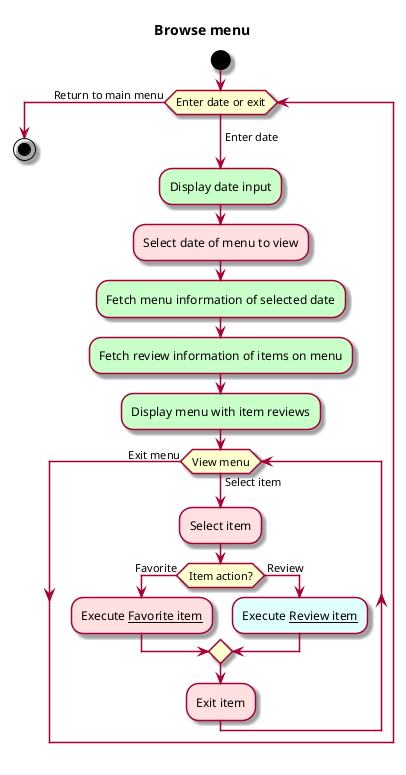

# Use case: Browse menu

```plantuml
@startuml

skin rose
title Browse menu

start
while (Enter date or exit) is (\nEnter date)
#technology:Display date input;
#implementation:Select date of menu to view;
#technology:Fetch menu information of selected date;
#technology:Fetch review information of items on menu;
#technology:Display menu with item reviews;
while (View menu) is (Select item)
#implementation:Select item;
    if (Item action?) then (Favorite)
        #implementation:Execute __Favorite item__;
    else ( Review)
        #LightCyan:Execute __Review item__;
endif
#implementation:Exit item;
endwhile (Exit menu)
endwhile (Return to main menu)
stop
@enduml
```