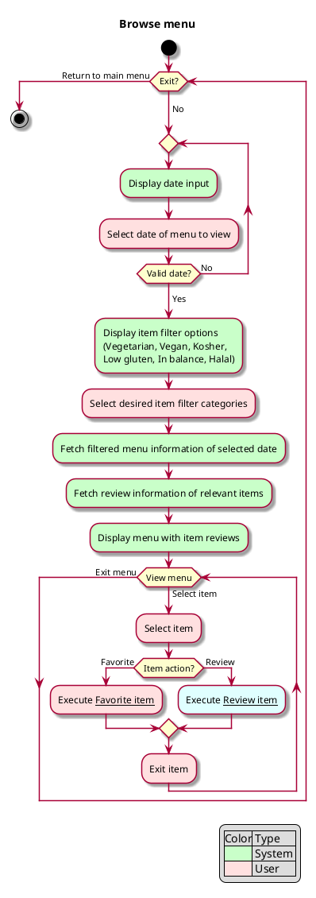

# Use case: Browse menu

## 1. Primary actor and goals
__Reader__: Wants to see available dishes on a chosen day. Wants to see others'
ratings of the available food. Wants to be able to add a dish to their favorites.
Wants accurate information for the day and to save any items added as a favorite.

## 2. Other stakeholders and their goals
* __Reviewer__: Wants to be able to choose an item from the menu to review. Wants
their review to be saved and visible to Readers.
* __CBA__: Wants to see average reviews of menu items. Wants up-to-date
information to see which items are well-liked by students. Wants to limit
robot access to website if egregious.

## 3. Preconditions
* Reader has opened the application and chosen to view menus.

## 4. Postconditions
* Any favorites added have been saved.
* Any reviews added have been saved.

## 5. Workflow
__Fully dressed__: All scenarios and variations in detail.

Color code: pink for Reader, green for System.

