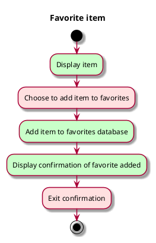

# Use case: Favorite item

## 1. Primary actor and goals
__Reader__: Wants to add chosen item to their list of favorites to later be notified
if the item becomes available. Wants confirmation that the correct item was added to
the favorites list successfully.

## 2. Other stakeholders and their goals
* None

## 3. Precondition
* Reader has selected an item.

## 4. Postconditions
* System database of favorites includes chosen item.
* Reader has seen confirmation that item was successfully added.

## 5. Workflow
__Brief__: main success scenario only, does not address any errors on the part of
the system to add the item to the database or the Reader no longer wanting to add
the item to their favorites list.
