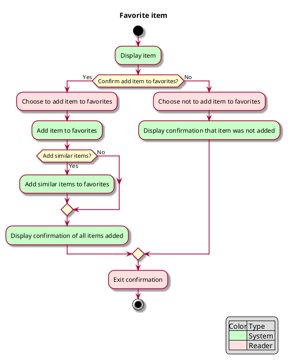

# Use case: Favorite item

## 1. Primary actor and goals
__Reader__: Wants to add chosen item to their list of favorites to later be notified
if the item becomes available. Wants confirmation that the correct item was added to
the favorites list successfully.

## 2. Other stakeholders and their goals
* None

## 3. Precondition
* Reader has selected an item.

## 4. Postconditions
* System database of favorites includes chosen item.
* Reader has seen confirmation that item was successfully added.

## 5. Workflow
__Fully dressed__: All scenarios and variations in detail.

Color code: pink for Reader, green for System.

