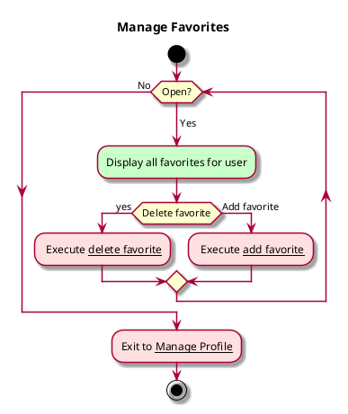

# Use case: Manage Favorites

## 1. Primary actor and goals
__Reader/User__: wants to be able to manage their favorites en masse without having to find them across the list of all menu items ever offered

## 2. Other stakeholders and their goals

* __CBA__: Want to rate limit robot access to webpage if egregious

## 2. Preconditions

* User is on manage profile page

## 4. Postconditions

* User favorites are updated as desired.
* Changes are synced (e.g. to server is profile syncing is designed)
* User receives confirmation of updates as they are made.

## 4. Workflow

__Brief__ overview

