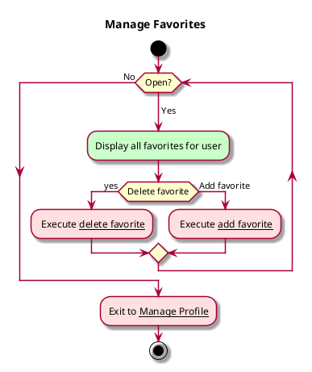

# Use case: Manage Favorites

```plantuml
@startuml

skin rose
title Manage Favorites

start
while (Open?) is (\nYes)
#technology:Display all favorites for user;
If (Delete favorite) then (yes)
    #implementation: Execute __delete favorite__;
else (Add favorite)
     #implementation: Execute __add favorite__;
endif
endwhile (No)
#implementation:Exit to __Manage Profile__;
stop
@enduml
```