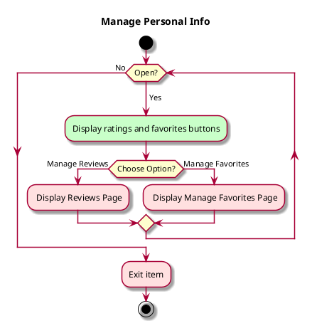

# Use case: Manage Personal Info

## 1. Primary actor and goals
__Reader/User__: wants to be able to update their reviews/favorites

## 2. Other stakeholders and their goals

N/A

## 2. Preconditions

## 4. Postconditions

* User is redirected to desired sub-menu

## 4. Workflow

__Brief__ overview

