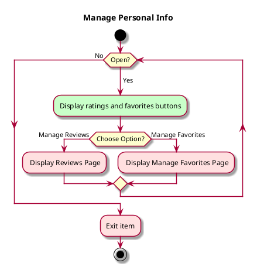

# Use case: Manage Personal Info

```plantuml
@startuml

skin rose
title Manage Personal Info

start
while (Open?) is (\nYes)
#technology:Display ratings and favorites buttons;
If (Choose Option?) then (Manage Reviews)
    #implementation: Display Reviews Page;
else (Manage Favorites)
     #implementation: Display Manage Favorites Page;
endif
endwhile (No)
#implementation:Exit item;
stop
@enduml
```