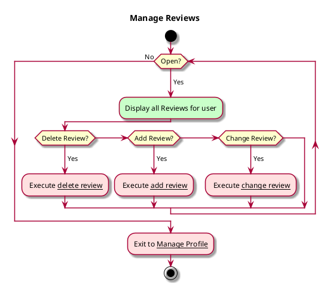

# Use case: Manage Reviews

```plantuml
@startuml

skin rose
title Manage Reviews

start
while (Open?) is (\nYes)
#technology:Display all Reviews for user;
If (Delete Review?) then (\nYes)
    #implementation: Execute __delete review__;
elseif (Add Review?) then (\nYes)
     #implementation: Execute __add review__;
elseif (Change Review?) then (\nYes)
     #implementation: Execute __change review__;
endif
endwhile (No)
#implementation:Exit to __Manage Profile__;
stop
@enduml
```