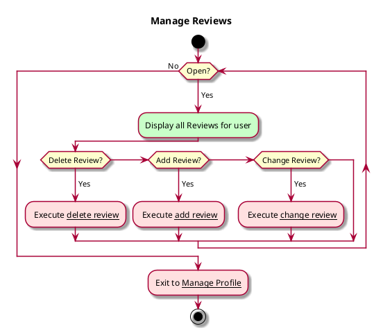

# Use case: Manage Reviews
# Use case: Manage Personal Info

## 1. Primary actor and goals
__Reader/User__: wants to be able to update their reviews en masse

## 2. Other stakeholders and their goals

* Other readers: want to be able to view accurate reviews

## 2. Preconditions

* User is on manage profile page

## 4. Postconditions

* User reviews are updated as desired.
* Changes are synced (e.g. to server is profile syncing is designed)
* User receives confirmation of updates as they are made.

## 4. Workflow

__Brief__ overview

