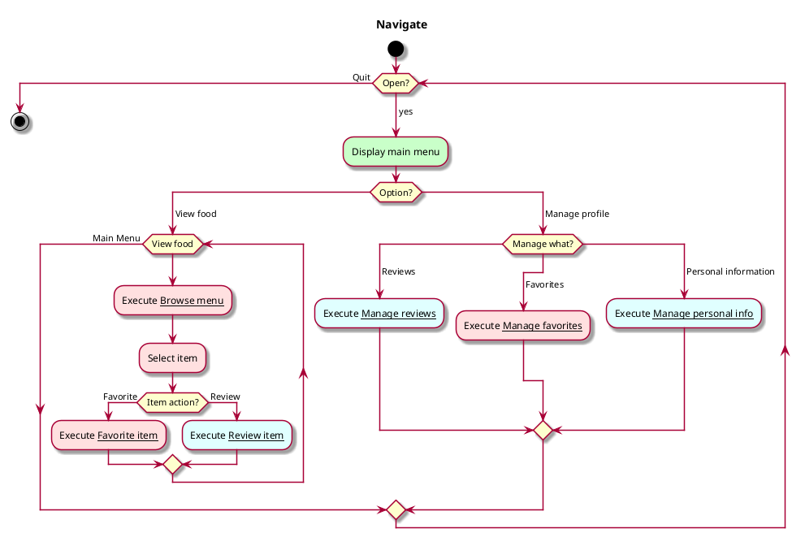

# Use case: Navigate

```plantuml
@startuml

skin rose
title Navigate

start
while (Open?) is (\nyes)
#technology:Display main menu;
switch (Option?)
    case ( View food)
        while (View food) is ( )
            #implementation:Execute __Browse menu__;
            #implementation:Select item;
            if (Item action?) then (Favorite)
                #implementation:Execute __Favorite item__;
            else ( Review)
                #LightCyan:Execute __Review item__;
            endif
        endwhile (Main Menu )
    case ( Manage profile)
        switch (Manage what?)
            case ( Reviews)
                #LightCyan:Execute __Manage reviews__;
            case (\n Favorites)
            
                #implementation:Execute __Manage favorites__;
            case ( Personal information)
                #LightCyan:Execute __Manage personal info__;
        endswitch
endswitch
endwhile (Quit )
stop
@enduml
```