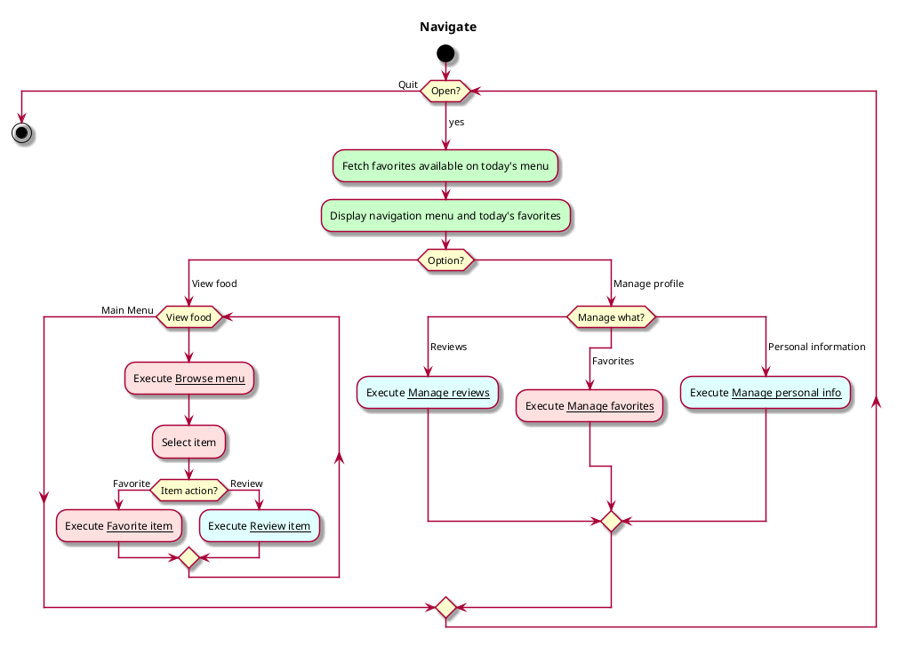

# Use case: Navigate App

## 1. Primary actor and goals
* __Reader/User__: wants to be able to browse CBA menu items and see reviews
* __Reviewer__: wants to be able to contribute their opinion (in the form of a rating) on menu items 

## 2. Other stakeholders and their goals

* __CBA__: Want to rate limit robot access to webpage if egregious

## 2. Preconditions

* App is open to main page

## 4. Postconditions

* User found desired item and reviewed / read reviews.
* User was able to update profile items as needed
* Updates were synced to server

## 4. Workflow

__Fully dressed__ overview

