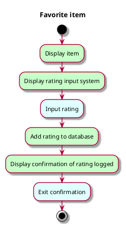

# Use case: Review item

## 1. Primary actor and goals
__Reviewer__: Wants to add a review to the chosen item. Wants the review to accurately
reflect their perception of/feelings about the dish. Wants their review to be visible
to others.

## 2. Other stakeholders and their goals
* __CBA__: Wants reviews accurately recorded to see students' opinions
on their meals offered.

## 3. Preconditions
* Reviewer has chosen an item.

## 4. Postconditions
* Review is added to the system's database and is connected to the Reviewer and the
reviewed item.
* Reviewer has seen confirmation that review was successfully recorded.

## 5. Workflow
Brief: main success scenario only, does not address any errors on the part of
the system to add the item to the database or the Reviewer wanting to change the
item they are reviewing or the rating they are giving the item.
