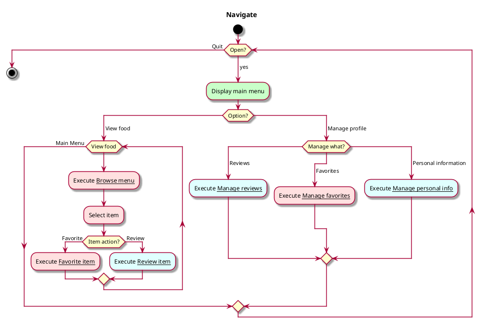

# Vision document

## Summary
Android app that allows users to rate Vassar Dining offerings 
and informs them when their favorites are available.

## Main features and constraints
Features:
* Fetch and display Bon Appetit menus for Gordon Commons
* Collect star ratings of food items
* Display collected ratings on menu
* Send notifications when favorited items are in stock
* Allow users to mark favorite food items

Constraints:
* Android application written in Java
* Menu availability limited by Bon Appetit

## Actors and goals 
Actors: reader, reviewer
External actor: Cafe Bon Appetit

Reader goals:
* See all food available on given date
* Swap between dates
* See average rating of each food item
* Mark item as personal favorite
* Get notified when favorite is available
* Manage favorite items

Reviewer goals:
* Find desired item to review
* Input review
* Manage reviews
* Manage profile

Cafe Bon Appetit goals:
* View food ratings

## Use case diagrams
